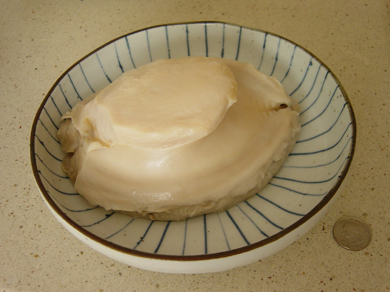

Data Science Dojo  
Copyright (c) 2019 - 2020

---

**Level:** Beginner  
**Recommended Use:** Regression Models 
**Domain:** Environment  

## Abalone Data Set 

### Find out the age of Abalone from physical measurements 

---

<a href="http://creativecommons.org/licenses/by-sa/3.0/" title="Creative Commons Attribution-Share Alike 3.0">CC BY-SA 3.0</a>, <a href="https://commons.wikimedia.org/w/index.php?curid=203620">Link</a>
---

This *beginner* level data set has 4177 rows and 9 columns and physical measurements of abalones and the number of rings (representing age).
The age of abalone is determined by cutting the shell through the cone, staining it, and counting the number of rings through a microscope -- a boring and time-consuming task. 
Other measurements, which are easier to obtain, are used to predict the age. 

This data set is recommended for learning and practicing your skills in **exploratory data analysis**, **data visualization**, and **classification modelling techniques**. 
Feel free to explore the data set with multiple **supervised** and **unsupervised** learning techniques. The Following data dictionary gives more details on this data set:

---

### Data Dictionary 

| Column   Position 	| Atrribute Name 	| Definition                                                 	| Data Type    	| Example                	| % Null Ratios 	|
|-------------------	|----------------	|------------------------------------------------------------	|--------------	|------------------------	|---------------	|
| 1                 	| Sex            	| Sex (M: Male, F: Female, I: Infant)                        	| Quantitative 	| "M", "F", "I"          	| 0             	|
| 2                 	| Length         	| Longest Shell measurement (millimeters - mm)               	| Qualitative  	| 0.530, 0.440, 0.425    	| 0             	|
| 3                 	| Diameter       	| Diameter - perpendicular to length (mm)                    	| Qualitative  	| 0.350, 0.380, 0.300    	| 0             	|
| 4                 	| Height         	| Height - with meat in shell (mm)                           	| Qualitative  	| 0.095, 0.150, 0.110    	| 0             	|
| 5                 	| Whole weight   	| Weight of whole abalone (grams)                            	| Qualitative  	| 0.5140, 0.2255, 0.6845 	| 0             	|
| 6                 	| Shucked weight 	| Weight of meat (grams)                                     	| Qualitative  	| 0.1940, 0.1675, 0.0975 	| 0             	|
| 7                 	| Viscera weight 	| Gut weight after bleeding (grams)                          	| Qualitative  	| 0.1010, 0.1495, 0.0490 	| 0             	|
| 8                 	| Shell weight   	| Shell weight - after being dried (grams)                   	| Qualitative  	| 0.330, 0.115, 0.245    	| 0             	|
| 9                 	| Rings          	| Rings - value + 1.5 gives age in years (eg. 4 = 5.5 years) 	| Qualitative  	| 19, 8, 29              	| 0             	|
---

### Acknowledgement

This data set has been sourced from the Machine Learning Repository of University of California, Irvine [Abalone Data Set (UC Irvine)](https://archive.ics.uci.edu/ml/datasets/Abalone). 
The UCI page mentions the following study as the original source of the data set:

*Warwick J Nash, Tracy L Sellers, Simon R Talbot, Andrew J Cawthorn and Wes B Ford (1994) 
"The Population Biology of Abalone (_Haliotis_ species) in Tasmania. I. Blacklip Abalone (_H. rubra_) from the North Coast and Islands of Bass Strait", 
Sea Fisheries Division, Technical Report No. 48 (ISSN 1034-3288)* 