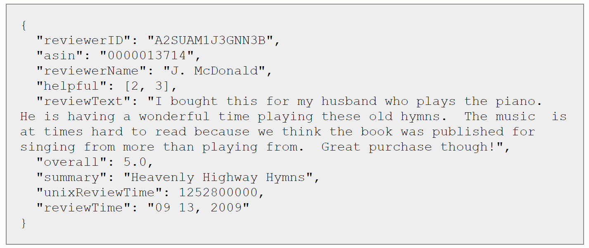

Data Science Dojo  
Copyright (c) 2020

---

**Level:** Advanced  
**Recommended Use:** Text Analytics 
**Domain:** Marketing 

# Amazon product reviews data

This dataset contains product reviews and metadata from Amazon, including 142.8 million reviews spanning May 1996 - July 2014.

This dataset includes reviews (ratings, text, helpfulness votes), product metadata (descriptions, category information, price, brand, and image features), and links (also viewed/also bought graphs).

This dataset is probably preferable for sentiment analysis type tasks.

## Link to dataset
[aggressively deduplicated data (18gb)] (http://snap.stanford.edu/data/amazon/productGraph/aggressive_dedup.json.gz)

No duplicates whatsoever (82.83 million reviews). file removes duplicates more aggressively, removing duplicates even if they are written by different users. This accounts for users with multiple accounts or plagiarized reviews.

Format is one-review-per-line in (loose) json. See examples below for further help reading the data.

## Sample review  

where

- reviewerID - ID of the reviewer, e.g. A2SUAM1J3GNN3B
- asin - ID of the product, e.g. 0000013714
- reviewerName - name of the reviewer
- helpful - helpfulness rating of the review, e.g. 2/3
- reviewText - text of the review
- overall - rating of the product
- summary - summary of the review
- unixReviewTime - time of the review (unix time)
- reviewTime - time of the review (raw)

## Acknowledgement

This data set has been sourced from [jmcauley.ucsd.edu/data/amazon/links.html](http://jmcauley.ucsd.edu/data/amazon/links.html)

### Use of this data requires citation

Please cite one or both of the following if you use the data in any way:

Ups and downs: Modeling the visual evolution of fashion trends with one-class collaborative filtering  
R. He, J. McAuley  
WWW, 2016  
[pdf](http://cseweb.ucsd.edu/~jmcauley/pdfs/www16a.pdf)

Image-based recommendations on styles and substitutes  
J. McAuley, C. Targett, J. Shi, A. van den Hengel  
SIGIR, 2015  
[pdf](http://cseweb.ucsd.edu/~jmcauley/pdfs/sigir15.pdf)