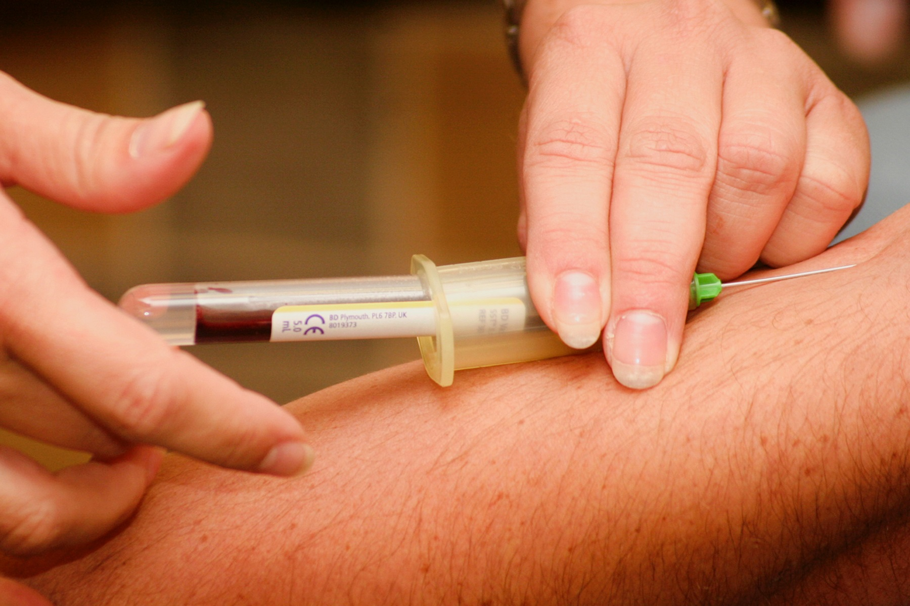

Data Science Dojo  
Copyright (c) 2019 - 2020

---

**Level** Intermediate  
**Recommended Use:** Classification Models 
**Domain:** Business  

## Blood Transfusion Service Center Data Set 

### Find out if a donor will give blood in March 2007 

---

---

This *intermediate* level data set has 748 instances and 5 attributes.
This data set is recommended for learning and practicing your skills in **exploratory data analysis**, **data visualization**, and **classification modelling techniques**. 
Feel free to explore the data set with multiple **supervised** and **unsupervised** learning techniques.

Following is the information about the Data Set provided in the source:

To demonstrate the RFMTC marketing model (a modified version of RFM), this study adopted the donor database of Blood Transfusion Service Center in Hsin-Chu City in Taiwan. The center passes their blood transfusion service bus to one university in Hsin-Chu City to gather blood donated about every three months. To 
build a FRMTC model, we selected 748 donors at random from the donor database. These 748 donor data, each one included R (Recency - months since last donation), F (Frequency - total number of donation), M (Monetary - total blood 
donated in c.c.), T (Time - months since first donation), and a binary variable representing whether he/she donated blood in March 2007 (1 stand for donating blood; 0 stands for not donating blood)

The Following data dictionary gives more details on this data set:

---

### Data Dictionary 

| Column   Position 	| Atrribute Name                               	| Definition                                                                                           	| Data Type    	| Example         	| % Null Ratios 	|
|-------------------	|----------------------------------------------	|------------------------------------------------------------------------------------------------------	|--------------	|-----------------	|---------------	|
| 1                 	| Recency (months)                             	| Number of   months since the particular donor's most recent donation                                 	| Quantitative 	| 5, 0, 2         	| 0             	|
| 2                 	| Frequency (times)                            	| Total number   of donations that the donor has made                                                  	| Quantitative 	| 50, 10, 9       	| 0             	|
| 3                 	| Monetary (c.c. blood)                        	| Total amound   of blood that the donor has donated (cubic centimeters)                               	| Quantitative 	| 4000, 2750, 500 	| 0             	|
| 4                 	| Time (months)                                	| Number of   months since the donor's first donation                                                  	| Quantitative 	| 16, 58, 69      	| 0             	|
| 5                 	| whether he/she donated blood in   March 2007 	| This is a   binary variable which represents whether the donor donated blood in March   2007: (1, 0) 	| Quantitative 	| 1, 0            	| 0             	|

### Acknowledgement

This data set has been sourced from the Machine Learning Repository of University of California, Irvine [Blood Transfusion Service Center Data Set (UC Irvine)](https://archive.ics.uci.edu/ml/datasets/Blood+Transfusion+Service+Center). The UCI page mentions Blood Transfusion Service Center, Hsin-Chu City, Taiwan as the original source of the data set.  