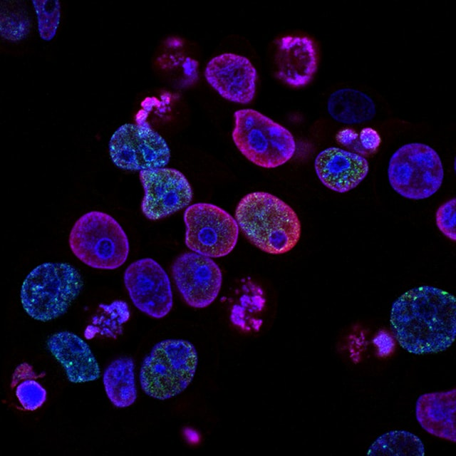

Data Science Dojo  
Copyright (c) 2019 - 2020

---

**Level** Intermediate  
**Recommended Use:** Classification/Anomaly Detection 
**Domain:** Health Sciences  

## Breast Cancer Wisconsin Data Set

---

---

The features of this dataset are computed from a digitized image of a fine needle aspirate (FNA) of a breast mass. 
They describe characteristics of the cell nuclei present in the image. 
The target feature records the prognosis (malignant or benign). 
Feel free to do **exploratory data analysis** and **data visualization** on the data set. The Following data dictionary gives more details on this data set:

---

### Data Dictionary

**Column Position** | **Attribute Name** 			|  **Description**                       | **Attribute Type**    
--------------------| ------------------------------|  --------------------------------------|------------------
     #1             |   Id number              		|  Sample code number                    | quantitative
     #2             |   Clump Thickness             |  Integer value from 1 to 10            | qualitative
     #3             |   Uniformity of Cell Size     |  Integer value from 1 to 10			 | qualitative           
     #4             |   Uniformity of Cell Shape    |  Integer value from 1 to 10            | quantitative    
     #5             |   Marginal Adhesion           |  Integer value from 1 to 10            | quantitative     
     #6             |   Single Epithelial Cell Size |  Integer value from 1 to 10            | qualitative
     #7             |   Bare Nuclei          		|  Integer value from 1 to 10            | qualitative
     #8             |   Bland Chromatin          	|  Integer value from 1 to 10            | quantitative
     #9             |   Normal Nucleoli            	|  Integer value from 1 to 10            | qualitative
     #10            |   Mitoses          			|  Integer value from 1 to 10            | quantitative
     #11            |   Class            			|  2 for benign, 4 for malignant         | qualitative

---

### Acknowledgement

[UCI Machine Learning Repository](https://archive.ics.uci.edu/ml/datasets/breast+cancer+wisconsin+(original)) 