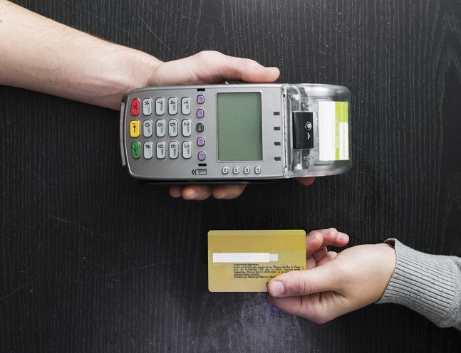

Data Science Dojo  
Copyright (c) 2019 - 2020

---

**Level:** Advanced  
**Recommended Use:** Classification Models 
**Domain:** Business/Finance  

## Default of Credit Card Clients Data Set 

### Estimate the probability of Default 

---

---

This *advanced* level data set has 30000 rows and 24 columns.
The data set could be used to estimate the probability of default payment by credit card client using the data provided.
This data set is recommended for learning and practicing your skills in **exploratory data analysis**, **data visualization**, and **classification modelling techniques**. 
Feel free to explore the data set with multiple **supervised** and **unsupervised** learning techniques. The Following data dictionary gives more details on this data set:

---

### Data Dictionary 

| Column   Position 	| Atrribute Name                	| Definition                                                                                                                            	| Data Type    	| Example              	| % Null Ratios 	|
|-------------------	|-------------------------------	|---------------------------------------------------------------------------------------------------------------------------------------	|--------------	|----------------------	|---------------	|
| 1                 	| X1: LIMIT_BAL                 	| Amount of the   given credit (NT dollar): it includes both the individual consumer credit and   his/her family (supplementary) credit 	| Quantitative 	| 50000, 320000, 40000 	| 0             	|
| 2                 	| X2: SEX                       	| Gender (1 =   male; 2 = female)                                                                                                       	| Quantitative 	| 1, 2                 	| 0             	|
| 3                 	| X3: EDUCATION                 	| Education (1 =   graduate school; 2 = university; 3 = high school; 4 = others)                                                        	| Quantitative 	| 1, 2, 3              	| 0             	|
| 4                 	| X4: MARRIAGE                  	| Marital status   (1 = married; 2 = single; 3 = others)                                                                                	| Quantitative 	| 1, 2, 3              	| 0             	|
| 5                 	| X5: AGE                       	| Age (year)                                                                                                                            	| Quantitative 	| 37, 29, 43           	| 0             	|
| 6                 	| X6: PAY_0                     	| History of   past payment. The repayment status in September, 2005*                                                                   	| Quantitative 	| 0, 1, -1             	| 0             	|
| 7                 	| X7: PAY_2                     	| History of past payment. The repayment status in August, 2005*                                                                        	| Quantitative 	| 0, 2, -2             	| 0             	|
| 8                 	| X8: PAY_3                     	| History of past payment. The repayment status in July, 2005*                                                                          	| Quantitative 	| 0, -2, -1            	| 0             	|
| 9                 	| X9: PAY_4                     	| History of past payment. The repayment status in June, 2005*                                                                          	| Quantitative 	| 0, 2, 1              	| 0             	|
| 10                	| X10: PAY_5                    	| History of past payment. The repayment status in May, 2005*                                                                           	| Quantitative 	| 1, -2, 1             	| 0             	|
| 11                	| X11: PAY_6                    	| History of past payment. The repayment status in April, 2005*                                                                         	| Quantitative 	| 0, 1, -1             	| 0             	|
| 12                	| X12: BILL_AMT1                	| Amount of bill   statement in September, 2005 (NT dollar)                                                                             	| Quantitative 	| 46990, 58267, 38257  	| 0             	|
| 13                	| X13: BILL_AMT2                	| Amount of bill   statement in August, 2005 (NT dollar)                                                                                	| Quantitative 	| 48233, 59246, 38901  	| 0             	|
| 14                	| X14: BILL_AMT3                	| Amount of bill   statement in July, 2005 (NT dollar)                                                                                  	| Quantitative 	| 49291, 60184, 38103  	| 0             	|
| 15                	| X15: BILL_AMT4                	| Amount of bill   statement in June, 2005 (NT dollar)                                                                                  	| Quantitative 	| 28314, 58622, 36207  	| 0             	|
| 16                	| X16: BILL_AMT5                	| Amount of bill   statement in May, 2005 (NT dollar)                                                                                   	| Quantitative 	| 28959, 62307, 33138  	| 0             	|
| 17                	| X17: BILL_AMT6                	| Amount of bill   statement in April, 2005 (NT dollar)                                                                                 	| Quantitative 	| 29547, 63526, 31339  	| 0             	|
| 18                	| X18: PAY_AMT1                 	| Amount of   previous payment. Paid in September, 2005 (NT dollar)                                                                     	| Quantitative 	| 2000, 2500, 1700     	| 0             	|
| 19                	| X19: PAY_AMT2                 	| Amount of   previous payment. Paid in August, 2005 (NT dollar)                                                                        	| Quantitative 	| 2019, 2500, 1504     	| 0             	|
| 20                	| X20: PAY_AMT3                 	| Amount of   previous payment. Paid in July, 2005 (NT dollar)                                                                          	| Quantitative 	| 1200, 0, 1200        	| 0             	|
| 21                	| X21: PAY_AMT4                 	| Amount of   previous payment. Paid in June, 2005 (NT dollar)                                                                          	| Quantitative 	| 1100, 4800, 1500     	| 0             	|
| 22                	| X22: PAY_AMT5                 	| Amount of   previous payment. Paid in May, 2005 (NT dollar)                                                                           	| Quantitative 	| 1069, 2400, 1500     	| 0             	|
| 23                	| X23: PAY_AMT6                 	| Amount of   previous payment. Paid in April, 2005 (NT dollar)                                                                         	| Quantitative 	| 1000, 1600, 1000     	| 0             	|
| 24                	| Y: Default Payment Next Month 	| Probability of Default. (1: Yes, 0: No)                                                                                               	| Quantitative 	| 1, 0                 	| 0             	|---

*The measurement scale for the repayment status is: -1 = pay duly; 1 = payment delay for one month; 2 = payment delay for two months; . . .; 8 = payment delay for eight months; 9 = payment delay for nine months and above. 

### Acknowledgement

This data set has been sourced from the Machine Learning Repository of University of California, Irvine [Default of Credit Card Clients Data Set (UC Irvine)](https://archive.ics.uci.edu/ml/datasets/default+of+credit+card+clients). 
The UCI page mentions the following publication as the original source of the data set:

*Yeh, I. C., & Lien, C. H. (2009). The comparisons of data mining techniques for the predictive accuracy of probability of default of credit card clients. Expert Systems with Applications, 36(2), 2473-2480*

