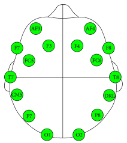

Data Science Dojo   
Copyright (c) 2019 - 2020

---

**Level:** Advanced  
**Recommended Use:** Classification   
**Domain:** Neuroscience/Healthcare  

---

## EEG Eye State Dataset

---

The EEG Eye State Dataset is an advanced dataset of EEG (brainwave) Signals recorded to study the EEG activity of the brain with the eyes closed and open.

The data was recorded via the Emotiv Epoc+ EEG Headset with the subject having their eyes open and closed. The Emotiv Epoc+ EEG Headset has 14 electrodes placed at different areas of the scalp. Each row contains electrical signals generated by the brain gathered from the electrodes.

This data set can be used to explore which areas of the brain are active when a subject is receiving visual stimuli. This dataset is recommended for practicing classification models.

---

### Data Dictionary

| Column Number | Attribute                    | Attribute Description                                    | Data Type |
| ------------- | ---------------------------- | -------------------------------------------------------- | --------- |
| 1             | ATTRIBUTE AF3 NUMERIC        | Data from EEG Sensor placed at AF3 Location on the Skull | Numeric   |
| 2             | ATTRIBUTE F7 NUMERIC         | Data from EEG Sensor placed at F7 Location on the Skull  | Numeric   |
| 3             | ATTRIBUTE F3 NUMERIC         | Data from EEG Sensor placed at F3 Location on the Skull  | Numeric   |
| 4             | ATTRIBUTE FC5 NUMERIC        | Data from EEG Sensor placed at FC5 Location on the Skull | Numeric   |
| 5             | ATTRIBUTE T7 NUMERIC         | Data from EEG Sensor placed at T7 Location on the Skull  | Numeric   |
| 6             | ATTRIBUTE P7 NUMERIC         | Data from EEG Sensor placed at P7 Location on the Skull  | Numeric   |
| 7             | ATTRIBUTE O1 NUMERIC         | Data from EEG Sensor placed at O1 Location on the Skull  | Numeric   |
| 8             | ATTRIBUTE O2 NUMERIC         | Data from EEG Sensor placed at O2 Location on the Skull  | Numeric   |
| 9             | ATTRIBUTE P8 NUMERIC         | Data from EEG Sensor placed at P8 Location on the Skull  | Numeric   |
| 10            | ATTRIBUTE T8 NUMERIC         | Data from EEG Sensor placed at T8 Location on the Skull  | Numeric   |
| 11            | ATTRIBUTE FC6 NUMERIC        | Data from EEG Sensor placed at FC6 Location on the Skull | Numeric   |
| 12            | ATTRIBUTE F4 NUMERIC         | Data from EEG Sensor placed at F4 Location on the Skull  | Numeric   |
| 13            | ATTRIBUTE F8 NUMERIC         | Data from EEG Sensor placed at F8 Location on the Skull  | Numeric   |
| 14            | ATTRIBUTE AF4 NUMERIC        | Data from EEG Sensor placed at AF4 Location on the Skull | Numeric   |
| 15            | ATTRIBUTE eyeDetection [0/1] | State of Eye  [0: Eye is Open, 1: Eye is Closed]      | Numeric   |

---
#### EEG Headset Electrode Placement

### Acknowledgement

This data set has been sourced from the Machine Learning Repository of
University of California, Irvine [EEG Eye State Dataset (UC Irvine)](https://archive.ics.uci.edu/ml/datasets/EEG+Eye+State). 
 
The UCI page mentions the following as the original source of the
data set:  
*Baden-Wuerttemberg Cooperative State University (DHBW), Stuttgart, Germany*
