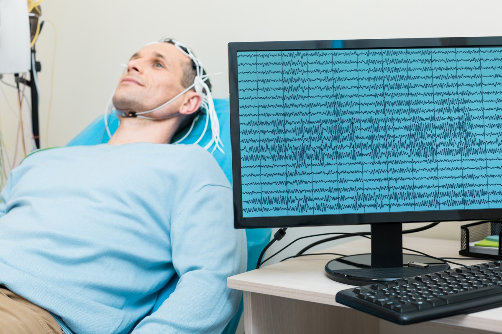
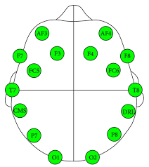

Data Science Dojo   
Copyright (c) 2019 - 2020

---

**Level:** Advanced  
**Recommended Use:** Dimensionality Reduction/Classification   
**Domain:** Neuroscience/Healthcare  

---

## EEG Steady State Evoked Potential Dataset

---

The EEG Steady State Evoked Potential dataset is a complex and advanced database of EEG (brainwave) Signals recorded from 30 participants to study Steady State Visually Evoked Potentials (SSVEP).

The data was recorded via the Emotiv Epoc+ EEG Headset while participants were exposed to different stimuli. The details of the participants and tests are explained in the Signals Database included in the dataset. The available CSV files contain raw time-series brainwave signals sampled at 128Hz while the participants were shown different stimuli.

The Emotiv Epoc+ EEG Headset has 14 electrodes placed at different areas of the scalp. Time-series data from each electrode is present in each column of the CSV data files. 

This data set can be used to explore which areas of the brain are active during different types of stimuli (for example, visual stimuli and motor imagery will be processed by different regions of the brain and hence different electrodes will be activated).

This data set is recommended for exploring dimensionality reduction techniques and classification models.

---
### File Dictionary

| File Name        | File Description                                                                                                                                                                 | File Type                         |
| ---------------- | -------------------------------------------------------------------------------------------------------------------------------------------------------------------------------- | --------------------------------- |
| Signals Database | File containing information about;  1. The participants the data was collected from  2. Details about the experiments conducted  3. EEG datasets for each experiment | Microsoft Excel Worksheet (.xlsx) |
| Handshake Test   | Explanation of the Handshake Motor Imagery Experiment                                                                                                                            | PDF File (.pdf)                   |
| A0xxxxx_x        | EEG Dataset containing time-series brainwave data                                                                                                                                | Comma Separated Value File (.csv) |

### Data Dictionary

| Column Number | Attribute    | Attribute Description                                                                                                                                 | Data Type |
| ------------- | ------------ | ----------------------------------------------------------------------------------------------------------------------------------------------------- | --------- |
| 1             | Counter      | Time-Domain Sample Number (Counter resets to 0 after every 128 samples which is exactly 1 second as the sampling rate of the EEG device is 128 Hz) | Numeric   |
| 2             | Interpolated | Interpolated Signal                                                                                                                                   | Numeric   |
| 3             | AF3          | Data from EEG Sensor placed at AF3 Location on the Skull                                                                                              | Numeric   |
| 4             | F7           | Data from EEG Sensor placed at F7 Location on the Skull                                                                                               | Numeric   |
| 5             | F3           | Data from EEG Sensor placed at F3 Location on the Skull                                                                                               | Numeric   |
| 6             | FC5          | Data from EEG Sensor placed at FC5 Location on the Skull                                                                                              | Numeric   |
| 7             | T7           | Data from EEG Sensor placed at T7 Location on the Skull                                                                                               | Numeric   |
| 8             | P7           | Data from EEG Sensor placed at P7 Location on the Skull                                                                                               | Numeric   |
| 9             | O1           | Data from EEG Sensor placed at O1 Location on the Skull                                                                                               | Numeric   |
| 10            | O2           | Data from EEG Sensor placed at O2 Location on the Skull                                                                                               | Numeric   |
| 11            | P8           | Data from EEG Sensor placed at P8 Location on the Skull                                                                                               | Numeric   |
| 12            | T8           | Data from EEG Sensor placed at T8 Location on the Skull                                                                                               | Numeric   |
| 13            | FC6          | Data from EEG Sensor placed at FC6 Location on the Skull                                                                                              | Numeric   |
| 14            | F4           | Data from EEG Sensor placed at F4 Location on the Skull                                                                                               | Numeric   |
| 15            | F8           | Data from EEG Sensor placed at F8 Location on the Skull                                                                                               | Numeric   |
| 16            | AF4          | Data from EEG Sensor placed at AF4 Location on the Skull                                                                                              | Numeric   |

---
#### EEG Headset Electrode Placement

### Acknowledgement

This data set has been sourced from the Machine Learning Repository of
University of California, Irvine [EEG Steady-State Visual Evoked Potential Signals Data Set (UC Irvine)](https://archive.ics.uci.edu/ml/datasets/EEG+Steady-State+Visual+Evoked+Potential+Signals). 
  
The UCI page mentions the following publications as the original source of the
data set:    
*Fernandez-Fraga, S. M., Aceves-Fernandez, M. A., Pedraza-Ortega, J. C. (2018). Feature Extraction of EEG Signal upon BCI Systems Based on Steady-State Visual Evoked Potentials Using the Ant Colony Optimization Algorithm. Discrete Dynamics in Nature and Society, 2018.*  
*S. M. Fernandez-Fraga, M. A. Aceves-Fernande, J. C. Pedraza-Ortega & J. M. Ramos-Arreguín (2018). Screen Task Experiments for EEG Signals Based on SSVEP Brain Computer Interface. International Journal of Advanced Research, 2018*
