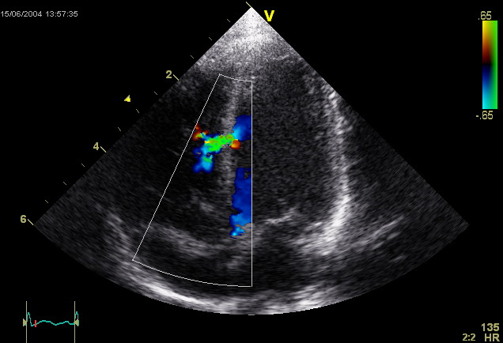

Data Science Dojo  
Copyright (c) 2019 - 2020

---

**Level:** Intermediate  
**Recommended Use:** Classification Models 
**Domain:** Automobiles  

## Echocardiogram Data Set 

### Will the patient survive for at least one year after a heart attack? 

---

Public Domain, <a href="https://commons.wikimedia.org/w/index.php?curid=141053">Link</a>
---

This *intermediate* level data set has 132 rows and 12 columns.
The data set provides data that could be used for classifying if patients will survive for at least one year after a heart attack.
All the patients suffered heart attacks at some point in the past. Some are still alive and some are not. 
The survival and still-alive variables, when taken together, indicate whether a patient survived for at least one year following the heart attack.

According to the source: 
The problem addressed by past researchers was to predict from the other variables whether or not the patient will survive at least one year. 
The most difficult part of this problem is correctly predicting that the patient will NOT survive. (Part of the difficulty seems to be the size of the data set.)

This data set is recommended for learning and practicing your skills in **exploratory data analysis**, **data visualization**, **dealing with missing values** and **classification modelling techniques**. 
Feel free to explore the data set with multiple **supervised** and **unsupervised** learning techniques. The Following data dictionary gives more details on this data set:

---

### Data Dictionary 

| Column   Position 	| Atrribute Name        	| Definition                                                                                                                                                                                                                                                                                                                                                                        	| Data Type    	| Example          	| % Null Ratios 	|
|-------------------	|-----------------------	|-----------------------------------------------------------------------------------------------------------------------------------------------------------------------------------------------------------------------------------------------------------------------------------------------------------------------------------------------------------------------------------	|--------------	|------------------	|---------------	|
| 1                 	| Survival              	| The number of   months patient survived (has survived, if patient is still alive).      Because all the patients had their heart attacks at different times, it is   possible that some patients have survived less than one year but they are   still alive. Check the second variable to confirm this. Such patients cannot   be used for the prediction task mentioned above.  	| Quantitative 	| 11, 57, 26       	| 2             	|
| 2                 	| Still-alive           	| A binary   variable that depicts if the patient is still alive (0: dead at end of   survival period, 1: still alive)                                                                                                                                                                                                                                                              	| Quantitative 	| 0, 1             	| 1             	|
| 3                 	| Age-at-heart-attack   	| Age in years   when heart attack occurred                                                                                                                                                                                                                                                                                                                                         	| Quantitative 	| 71, 57, 62       	| 4             	|
| 4                 	| Pericardial-effusion  	| Pericardial   effusion is fluid around the heart (0: no fluid, 1: fluid)                                                                                                                                                                                                                                                                                                          	| Quantitative 	| 0, 1             	| 1             	|
| 5                 	| Fractional-shortening 	| A measure of   contracility around the heart, lower numbers are increasingly abnormal                                                                                                                                                                                                                                                                                             	| Quantitative 	| 0.23, 0.13, 0.45 	| 6             	|
| 6                 	| Epss                  	| E-point septal   separation, another measure of contractility. Larger numbers are increasingly   abnormal                                                                                                                                                                                                                                                                         	| Quantitative 	| 6, 22, 12.062    	| 11            	|
| 7                 	| Lvdd                  	| Left   ventricular end-diastolic dimension. This is a measure of the size of the   heart at end-diastole. Large hearts tend to be sick hearts                                                                                                                                                                                                                                     	| Quantitative 	| 4.26, 4.23, 5.39 	| 8             	|
| 8                 	| Wall-motion-score     	| A measure of   how the segments of the left ventricle are moving                                                                                                                                                                                                                                                                                                                  	| Quantitative 	| 14, 22.5, 27     	| 3             	|
| 9                 	| Wall-motion-index     	| Equals   wall-motion-score divided by number of segments seen. Usually 12-13 segments   are seen in an echocardiogram. (Preferable to use this variable INSTEAD of   the wall motion score)                                                                                                                                                                                       	| Quantitative 	| 1, 1.625, 2      	| 1             	|
| 10                	| Mult                  	| A derivate   variable (suggested that it can be ignored)                                                                                                                                                                                                                                                                                                                          	| Quantitative 	| 0.558, 1, 1.003  	| 3             	|
| 11                	| Name                  	| The Name of   the patient (Has benn replaced with "name" entirely)                                                                                                                                                                                                                                                                                                                	| Qualitative  	| "name"           	| 0             	|
| 12                	| Group                 	| Group (Has been considered   meaningless and suggested to ignore)                                                                                                                                                                                                                                                                                                                 	| Quantitative 	| 1, 2             	| 17            	|
| 13                	| Alive-at-1            	| It is a   Boolean-valued variable derived from the first two attributes. (0: patient   was either dead after 1 year or had been followed for less than 1 year, 1:   patient was alive at 1 year)                                                                                                                                                                                  	| Quantitative 	| 1, 0             	| 44            	|
---

### Acknowledgement

This data set has been sourced from the Machine Learning Repository of University of California, Irvine [Echocardiogram Data Set (UC Irvine)](https://archive.ics.uci.edu/ml/datasets/Echocardiogram). 
The UCI page mentions the following author for providing the data set:
*Steven Salzberg (salzberg@cs.jhu.edu)*