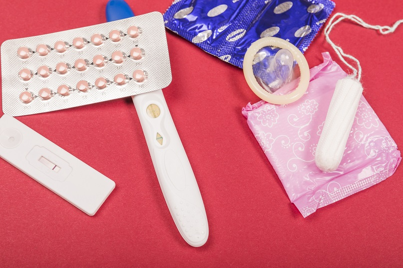

Data Science Dojo  
Copyright (c) 2019 - 2020

---

**Level:** Beginner  
**Recommended Use:** Regression/Classification Models 
**Domain:** Healthcare/Life  

## Fertility Data Set 

### Predict seminal quality of an indivisual

---

---

This *beginner* level data set has 100 rows and 10 columns.
The data set includes semen sample of 100 volunteers, analyzed according to the WHO 2010 criteria.
This data set can be used to determine if it is possible to reach a diagnosis without a laboratory approach, which include expensive tests, sometime uncomfortable for the patients.
Sperm concentration are related to socio-demographic data, environmental factors, health status, and life habits. Thes eattributes can be taken easily using a questionnaire.

This data set is recommended for learning and practicing your skills in **exploratory data analysis**, **data visualization**, and **regression/classification modelling techniques**. 
Feel free to explore the data set with multiple **supervised** and **unsupervised** learning techniques. The Following data dictionary gives more details on this data set:

---

### Data Dictionary 

| Column   Position 	| Atrribute Name                           	| Definition                                                                                                                                                                                                               	| Data Type    	| Example       	| % Null Ratios 	|
|-------------------	|------------------------------------------	|--------------------------------------------------------------------------------------------------------------------------------------------------------------------------------------------------------------------------	|--------------	|---------------	|---------------	|
| 1                 	| Season                                   	| Season in   which the analysis was performed (-1: winter, -0.33: spring, 0.33: summer, 1:   fall)                                                                                                                        	| Quantitative 	| 1, -1, -0.33  	| 0             	|
| 2                 	| Age                                      	| Age at the   time of analysis. Age is between 18-36 and scaled from 0 to 1                                                                                                                                               	| Quantitative 	| 0.64, 0.78, 1 	| 0             	|
| 3                 	| Childish Diseases                        	| Childish   diseases i.e chicken pox, measles, mumps, polio (0: no, 1: yes)                                                                                                                                               	| Quantitative 	| 1, 0          	| 0             	|
| 4                 	| Accident or serious trauma               	| Accident or   serious trauma  (0: no, 1: yes)                                                                                                                                                                            	| Quantitative 	| 1, 0          	| 0             	|
| 5                 	| Surgical intervention                    	| Surgical   intervention (0: no, 1: yes)                                                                                                                                                                                  	| Quantitative 	| 1, 0          	| 0             	|
| 6                 	| High fevers in last year                 	| High fevers in   the last year (-1: less than 3 months ago, 0: more than 3 months ago, 1: no   fever)                                                                                                                    	| Quantitative 	| 0, 1, -1      	| 0             	|
| 7                 	| Frequency of alcohol consumption         	| Frequency of   alcohol consumption in 5 categories scaled from 0 to 1. Following are the   categories in order: 1) several times a day, 2) every day, 3) several times a   week, 4) once a week, 5) hardly ever or never 	| Quantitative 	| 0.2, 0.6, 1   	| 0             	|
| 8                 	| Smoking Habit                            	| Smoking habit   (-1: never, 0: occasional, 1: daily)                                                                                                                                                                     	| Quantitative 	| 0, 1, -1      	| 0             	|
| 9                 	| Number of   hours spent sitting per day  	| Number of   hours spent sitting per day. Between 0 and 16, scaled from 0 to 1                                                                                                                                            	| Quantitative 	| 0.32, 0.83, 1 	| 0             	|
| 10                	| Output                                   	| Output: Result   of Diagnosis (N: Normal, O: Altered)                                                                                                                                                                    	| Qualitative  	| N, O          	| 0             	|
---

### Acknowledgement

This data set has been sourced from the Machine Learning Repository of University of California, Irvine [Fertiltiy Data Set (UC Irvine)](https://archive.ics.uci.edu/ml/datasets/Fertility). 
The UCI page mentions the following publication as the original source of the data set:

*David Gil, Jose Luis Girela, Joaquin De Juan, M. Jose Gomez-Torres, and Magnus Johnsson. Predicting seminal quality with artificial intelligence methods*

