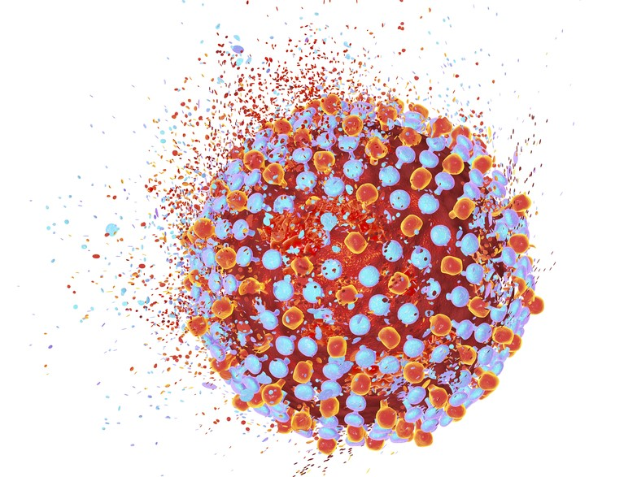

Data Science Dojo   
Copyright (c) 2019 - 2020

---

**Level:** Intermediate  
**Recommended Use:** Classification   
**Domain:** Healthcare  

---

### Hepatitis C Virus (HCV) Classification Dataset

---

---

The Hepatitis C Virus (HCV) Classification Dataset contains information about 1385 patients who underwent treatment for HCV. The dataset provides information about the symptoms the patients were experiencing as well as the results of their Liver Function Tests (LFTs) and Blood Panels before the start of treatment and at the end of the treatment.

This data set can be used to determine if it is possible to reach a diagnosis regarding HCV through only blood tests. It can also be used to predict the condition of a patients liver solely based on their bloodwork.

This data set is recommended for practicing classification modelling techniques.

---

### Data Dictionary

| Column Number | Attribute                     | Attribute Description                                                                                 | Data Type    |
| ------------- | ----------------------------- | ----------------------------------------------------------------------------------------------------- | ------------ |
| 1             | Age                           | Age of Patient                                                                                        | Numeric      |
| 2             | Gender                        | Gender of Patient [1: Male, 2: Female]                                                                | Numeric/Bool |
| 3             | BMI(Body Mass Index)          | Body Mass Index of Patient                                                                            | Numeric      |
| 4             | Fever                         | Presence of Fever  [1: Absent, 2: Present]                                                         | Numeric/Bool |
| 5             | Nausea/Vomiting               | Presence of Nausea/Vomiting [1: Absent, 2: Present]                                                | Numeric/Bool |
| 6             | Headache                      | Presence of Headache [1: Absent, 2: Present]                                                       | Numeric/Bool |
| 7             | Diarrhea                      | Presence of Diarrhea [1: Absent, 2: Present]                                                       | Numeric/Bool |
| 8             | Fatigue & Boneaches           | Presence of Fatigue [1: Absent, 2: Present]                                                        | Numeric/Bool |
| 9             | Jaundice                      | Presence of Jaundice [1: Absent, 2: Present]                                                       | Numeric/Bool |
| 10            | Epigastria pain               | Presence of Epigastric Pain [1: Absent, 2: Present]                                                | Numeric/Bool |
| 11            | WBC                           | White Blood Cell Count (per μl of blood)                                                           | Numeric      |
| 12            | RBC                           | Red Blood Cell Count (per μl of blood)                                                             | Numeric      |
| 13            | HGB                           | Haemoglobin (g/dL)                                                                                    | Numeric      |
| 14            | Plat                          | Platelet Count (per μl of blood)                                                                      | Numeric      |
| 15            | AST1(1 week)                  | Aspartate Aminotransferase Enzyme level at 1 week (units per litre)                                   | Numeric      |
| 16            | ALT1(1 week)                  | Alanine Aminotransferase Enzyme level at 1 week (units per litre)                                     | Numeric      |
| 17            | ALT4(4 weeks)                 | Alanine Aminotransferase Enzyme level at 4 weeks (units per litre)                                    | Numeric      |
| 18            | ALT12(12 weeks)               | Alanine Aminotransferase Enzyme level at 12 weeks (units per litre)                                   | Numeric      |
| 19            | ALT24(24 weeks)               | Alanine Aminotransferase Enzyme level at 24 weeks (units per litre)                                   | Numeric      |
| 20            | ALT36(36 weeks)               | Alanine Aminotransferase Enzyme level at 36 weeks (units per litre)                                   | Numeric      |
| 21            | ALT48(48 weeks)               | Alanine Aminotransferase Enzyme level at 48 weeks (units per litre)                                   | Numeric      |
| 22            | ALT after 24 w                | Alanine Aminotransferase Enzyme level after 24 weeks (units per litre)                                | Numeric      |
| 23            | RNA Base                      | RNA at Start of Treatment                                                                             | Numeric      |
| 24            | RNA 4                         | RNA at 4 Weeks                                                                                        | Numeric      |
| 25            | RNA 12                        | RNA at 12 Weeks                                                                                       | Numeric      |
| 26            | RNA EOT                       | RNA at End of Treatment                                                                               | Numeric      |
| 27            | RNA EF(Elongation Factor)     | RNA Elongation Factor                                                                                 | Numeric      |
| 28            | Baseline Histological Grading | Baseline Histological Grading Score  [0-16]                                                        | Numeric      |
| 29            | Baseline Histological         | Condition of Liver [0: No Fibrosis, 1: Portal Fibrosis, 2: Few Septa, 3: Many Septa, 4: Cirrhosis] | Numeric      |

---

### Acknowledgement

This data set has been sourced from the Machine Learning Repository of
University of California, Irvine [Hepatitis C Virus (HCV) for Egyptian patients Data Set (UC
Irvine)](https://archive.ics.uci.edu/ml/datasets/Hepatitis+C+Virus+%28HCV%29+for+Egyptian+patients#).  
 
The UCI page mentions the following publication as the original source of the
data set:  
*M. Nasr, K. El-Bahnasy, M. Hamdy and S. M. Kamal, "A novel model based on non invasive methods for prediction 
of liver fibrosis," 2017 13th International Computer Engineering Conference (ICENCO), Cairo, 2017, pp. 276-281.*
