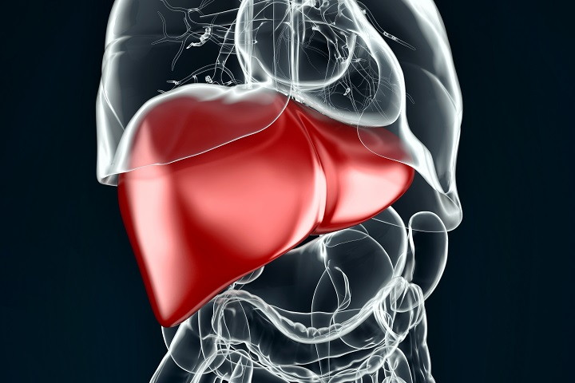

Data Science Dojo  
Copyright (c) 2019 - 2020

---

**Level:** Intermediate  
**Recommended Use:** Classification Models 
**Domain:** Healthcare  

## Hepatitis Data Set 

### Predict chance of survival 

---

---

This *intermediate* level data set has 155 rows and 20 columns and provides various attributes of a patient.
This data set is recommended for learning and practicing your skills in **exploratory data analysis**, **data visualization**, and **classification modelling techniques**. 
Feel free to explore the data set with multiple **supervised** and **unsupervised** learning techniques. The Following data dictionary gives more details on this data set:

---

### Data Dictionary 

| Column   Position 	| Atrribute Name  	| Definition                      	| Data Type    	| Example          	| % Null Ratios 	|
|-------------------	|-----------------	|---------------------------------	|--------------	|------------------	|---------------	|
| 1                 	| Class           	| Class (1: DIE, 2: LIVE)         	| Quantitative 	| 1, 2             	| 0             	|
| 2                 	| Age             	| Age (In Years)                  	| Quantitative 	| 34, 20, 55       	| 0             	|
| 3                 	| Sex             	| Sex (1: Male, 2: Female)        	| Quantitative 	| 1, 2             	| 0             	|
| 4                 	| Steroid         	| Steroid (No: 1, Yes: 2)         	| Quantitative 	| 1, 2             	| 1             	|
| 5                 	| Antivirals      	| Antivirals (No: 1, Yes: 2)      	| Quantitative 	| 1, 2             	| 0             	|
| 6                 	| Fatigue         	| Fatigue (No: 1, Yes: 2)         	| Quantitative 	| 1, 2             	| 1             	|
| 7                 	| Malaise         	| Malaise (No: 1, Yes: 2)         	| Quantitative 	| 1, 2             	| 1             	|
| 8                 	| Anorexia        	| Anorexia (No: 1, Yes: 2)        	| Quantitative 	| 1, 2             	| 1             	|
| 9                 	| Liver Big       	| Liver Big (No: 1, Yes: 2)       	| Quantitative 	| 1, 2             	| 10            	|
| 10                	| Liver Firm      	| Liver Firm (No: 1, Yes: 2)      	| Quantitative 	| 1, 2             	| 11            	|
| 11                	| Spleen Palpable 	| Spleen Palpable (No: 1, Yes: 2) 	| Quantitative 	| 1, 2             	| 5             	|
| 12                	| Spiders         	| Spiders (No: 1, Yes: 2)         	| Quantitative 	| 1, 2             	| 5             	|
| 13                	| Ascites         	| Ascites (No: 1, Yes: 2)         	| Quantitative 	| 1, 2             	| 5             	|
| 14                	| Varices         	| Varices (No: 1, Yes: 2)         	| Quantitative 	| 1, 2             	| 5             	|
| 15                	| Bilirubin       	| Bilirubin                       	| Quantitative 	| 0.39, 0.80, 1.20 	| 6             	|
| 16                	| Alk Phosphate   	| Alk Phosphate                   	| Quantitative 	| 33, 80, 120      	| 29            	|
| 17                	| Sgot            	| SGOT                            	| Quantitative 	| 13, 100, 200     	| 4             	|
| 18                	| Albumin         	| Albumin                         	| Quantitative 	| 2.1, 3.0, 3.8    	| 16            	|
| 19                	| Protime         	| Protime                         	| Quantitative 	| 60, 70, 80       	| 67            	|
| 20                	| Histology       	| Histology (No: 1, Yes: 2)       	| Quantitative 	| 1, 2             	| 0             	|
---

### Acknowledgement

This data set has been sourced from the Machine Learning Repository of University of California, Irvine [Hepatitis Data Set (UC Irvine)](https://archive.ics.uci.edu/ml/datasets/Hepatitis). 
The UCI page mentions the following authors for providing the data set:

*Dua, D. and Karra Taniskidou, E. (2017)*

