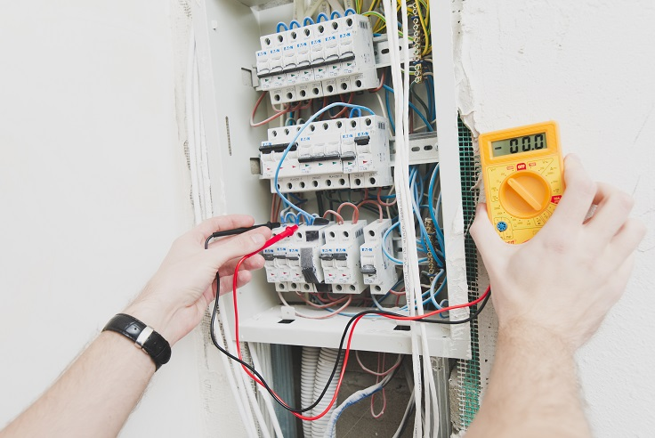

Data Science Dojo  
Copyright (c) 2019 - 2020

---

**Level:** Advanced  
**Recommended Use:** Regression/Clustering Models 
**Domain:** Electricity  

## Individual household electric power consumption Data Set 

### Find a short term forecast on electricity consumption of a single home

---

---

This *advanced* level data set has 2075259 rows and 9 columns.
This dataset provides measurements of electric power consumption in one household with a one-minute sampling rate over a period of almost 4 years.
Different electrical quantities and some sub-metering values are available.

This data set is recommended for learning and practicing your skills in **exploratory data analysis**, **data visualization**, **clustering** and **regression modelling techniques**. 
It also allows you to practice with large number of features. Feel free to explore the data set with multiple **supervised** and **unsupervised** learning techniques. The Following data dictionary gives more details on this data set:

---

### Data Dictionary 

| Column   Position 	| Atrribute Name        	| Definition                                                                                                                                                                                                              	| Data Type    	| Example                          	| % Null Ratios 	|
|-------------------	|-----------------------	|-------------------------------------------------------------------------------------------------------------------------------------------------------------------------------------------------------------------------	|--------------	|----------------------------------	|---------------	|
| 1                 	| Date                  	| Date: Date in   format dd/mm/yyyy                                                                                                                                                                                       	| Quantitative 	| 16/12/2006, 10/5/2007, 24/9/2007 	| ?             	|
| 2                 	| Time                  	| Time: time in   format hh:mm:ss                                                                                                                                                                                         	| Quantitative 	| 17:27:00, 6:56:00, 10:00:00      	| ?             	|
| 3                 	| Global_Active_Power   	| Global_active_power:   Household global minute-averaged active power (in kilowatt)                                                                                                                                      	| Quantitative 	| 4.216, 5.412, 3.488              	| ?             	|
| 4                 	| Global_Reactive_Power 	| Global_reactive_power:   Household global minute-averaged reactive power (in kilowatt)                                                                                                                                  	| Quantitative 	| 0.418, 0.47, 0.228               	| ?             	|
| 5                 	| Voltage               	| Voltage:   Minute-averaged voltage (in volt)                                                                                                                                                                            	| Quantitative 	| 234.84, 232.78, 233.06           	| ?             	|
| 6                 	| Global_Intensity      	| Global_intensity:   Household global minute-averaged current intensity (in ampere)                                                                                                                                      	| Quantitative 	| 18.4, 23.2, 15                   	| ?             	|
| 7                 	| Sub_Metering_1        	| Sub_metering_1:   Energy sub-metering No. 1 (in watt-hour of active energy). It corresponds to   the kitchen, containing mainly a dishwasher, an oven and a microwave (hot   plates are not electric but gas powered).  	| Quantitative 	| 1, 38, 17                        	| ?             	|
| 8                 	| Sub_Metering_2        	| Sub_metering_2:   Energy sub-metering No. 2 (in watt-hour of active energy). It corresponds to   the laundry room, containing a washing-machine, a tumble-drier, a   refrigerator and a light.                          	| Quantitative 	| 1, 36, 5                         	| ?             	|
| 9                 	| Sub_Metering_3        	| Sub_metering_3:   Energy sub-metering No. 3 (in watt-hour of active energy). It corresponds to   an electric water-heater and an air-conditioner                                                                        	| Quantitative 	| 17, 0, 18                        	| ?             	|

---

Note: 
(global_active_power*1000/60 - sub_metering_1 - sub_metering_2 - sub_metering_3) represents the active energy consumed every minute (in watt hour) in the household by electrical equipment not measured in sub-meterings 1, 2 and 3

### Acknowledgement

This data set has been sourced from the Machine Learning Repository of University of California, Irvine [Individual household electric power consumption Data Set (UC Irvine)](https://archive.ics.uci.edu/ml/datasets/Individual+household+electric+power+consumption). 
The UCI page mentions the following as the source of the data set:

*Georges Hebrail (georges.hebrail '@' edf.fr), Senior Researcher, EDF R&D, Clamart, France* 
*Alice Berard, TELECOM ParisTech Master of Engineering Internship at EDF R&D, Clamart, France*

