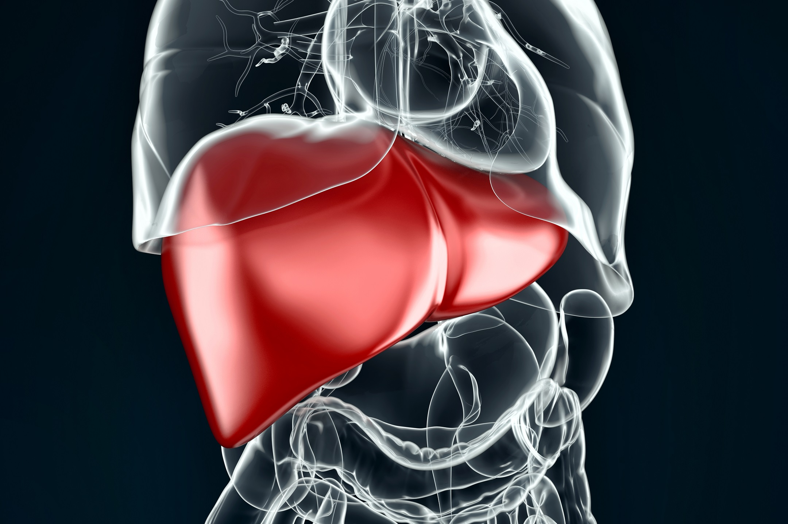

Data Science Dojo  
Copyright (c) 2019 - 2020

---

**Level:** Intermediate  
**Recommended Use:** Classification/Regression/Clustering Models 
**Domain:** Healthcare 

## Liver Disorders Data Set

### Discover patterns relating liver disorder and alcohol consumption

---

---

This *intermediate* level data set has 345 rows and 7 columns, where the 7th column is not a variable but just a train/test selector. The headers have to be manually placed in the data set.
The dataset does not contain any variable representing presence or absence of a liver disorder.
The first five columns are integer-valued and represent the result of various blood tests which may be of use in diagnosing alcohol-related liver disorders. The next, x6,  is real-valued and represents the number of alcoholic drinks (equivalent to half pints of beer) taken per day by the subject, selfreported 

This data set is recommended for learning and practicing your skills in **exploratory data analysis**, **data visualization**, **regression**, **classification** and **clustering** modelling techniques.
Feel free to explore the data set with multiple **supervised** and **unsupervised** learning techniques.
The Following data dictionary gives more details on this data set:

---

### Data Dictionary

| Column   Position 	| Attribute Name            	| Definition                                                           	| Data Type    	| Example       	| % Null Ratios 	|
|-------------------	|---------------------------	|----------------------------------------------------------------------	|--------------	|---------------	|---------------	|
| 1                 	| Mcv                       	| Mean Corpuscular Volume (Blood Test)                                 	| Quantitative 	| 85, 91, 96    	| 0             	|
| 2                 	| Alkphos                   	| Alkaline Phosphotase (Blood Test)                                    	| Quantitative 	| 78, 55, 70    	| 0             	|
| 3                 	| Sgpt                      	| Alamine Aminotransferase (Blood Test)                                	| Quantitative 	| 45, 12, 15    	| 0             	|
| 4                 	| Sgot                      	| Aspartate Aminotransferase (Blood Test)                              	| Quantitative 	| 27, 17, 33    	| 0             	|
| 5                 	| Gammagt                   	| Gamma-Glutamyl Transpeptidase (Blood Test)                           	| Quantitative 	| 31, 54, 36    	| 0             	|
| 6                 	| Drinks                    	| Number of half-pint equivalents of alcoholic beverages drunk per day 	| Quantitative 	| 0.5, 3.0, 8.0 	| 0             	|
| 7                 	| Selector (Not a variable) 	| Field used to split data into two sets                               	| Quantitative 	| 1, 2          	| 0             	|

### Acknowledgement

This data set has been sourced from the Machine Learning Repository of University of California, Irvine [Liver Disorders Data Set (UC Irvine)](https://archive.ics.uci.edu/ml/datasets/Liver+Disorders).
The UCI page mentions BUPA Medical Research Ltd as the original source of the data set.  
