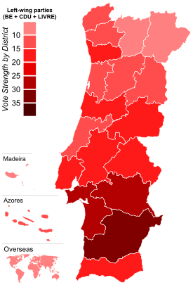

Data Science Dojo   
Copyright (c) 2019 - 2020

---

**Level:** Advanced  
**Recommended Use:** Regression   
**Domain:** Social Sciences  

---

## Portugal 2019 Election Dataset

---

This advanced dataset contains real-time election results of the 2019 Portuguese Parliamentary Election.

The data contains information about the results of the 27 parties involved in the election. The results were updated at an interval of 5 minutes and the entire process spanned a total of 4 hours and 25 minutes.

This dataset can be used for predictive modelling and numerical forecasting tasks.

---

### Data Dictionary

| Column Number | Attribute                | Attribute Description                                                              | Data Type |
| ------------- | ------------------------ | ---------------------------------------------------------------------------------- | --------- |
| 1             | TimeElapsed              | Time (in minutes) since first Data Acquisition                                     | Numeric   |
| 2             | time                     | Date and Time of Acquisition of Record                                             | Date/Time |
| 3             | territoryName            | Name of Territory/Location                                                         | Text      |
| 4             | totalMandates            | Number of Currently elected MPs                                                    | Numeric   |
| 5             | availableMandates        | Number Electable MPs                                                               | Numeric   |
| 6             | numParishes              | Number of Parishes in the Territory/Location                                       | Numeric   |
| 7             | numParishesApproved      | Number of approved Parishes in the Territory/Location                              | Numeric   |
| 8             | blankVotes               | Number of blank votes                                                              | Numeric   |
| 9             | blankVotesPercentage     | Percentage of blank votes                                                          | Numeric   |
| 10            | nullVotes                | Number of null votes                                                               | Numeric   |
| 11            | nullVotesPercentage      | Percentage of null votes                                                           | Numeric   |
| 12            | votersPercentage         | Percentage of voters from total population                                         | Numeric   |
| 13            | subscribedVoters         | Number of subscribed voters in the Territory/Location                              | Numeric   |
| 14            | totalVoters              | Percentage of blank votes                                                          | Numeric   |
| 15            | pre.blankVotes           | Number of blank votes in previous election                                         | Numeric   |
| 16            | pre.blankVotesPercentage | Percentage of blank votes in previous election                                     | Numeric   |
| 17            | pre.nullVotes            | Number of null votes in previous election                                          | Numeric   |
| 18            | pre.nullVotesPercentage  | Percentage of null votes in previous election                                      | Numeric   |
| 19            | pre.votersPercentage     | Percentage of voters in previous election                                          | Numeric   |
| 20            | pre.subscribedVoters     | Number of subscribed voters in the Territory/Location during the previous election | Numeric   |
| 21            | pre.totalVoters          | Percentage of blank votes in the previous election                                 | Numeric   |
| 22            | Party                    | Political Party                                                                    | Text      |
| 23            | Mandates                 | MP's elected at the moment for the party in a given district                       | Numeric   |
| 24            | Percentage               | Percentage of votes in a party                                                     | Numeric   |
| 25            | validVotesPercentage     | Percentage of valid votes in a party                                               | Numeric   |
| 26            | Votes                    | Percentage of party votes                                                          | Numeric   |
| 27            | Hondt                    | Number of MP's according to the distribution of votes now                          | Numeric   |
| 28            | FinalMandates            | Target: final number of elected MP's in a district/national-level                  | Numeric   |

---

### Acknowledgement

This data set has been sourced from the Machine Learning Repository of
University of California, Irvine [Real-time Election Results: Portugal 2019 Data Set (UC
Irvine)](https://archive.ics.uci.edu/ml/datasets/Real-time+Election+Results%3A+Portugal+2019). 
 
The UCI page mentions the following publication as the original source of the
data set:  
*[Nuno Moniz (2019) Real-time 2019 Portuguese Parliament Election Results Dataset](https://arxiv.org/abs/1912.08922)*
