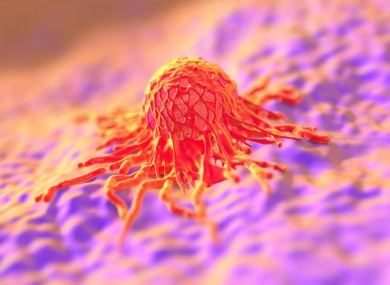

Data Science Dojo   
Copyright (c) 2019 - 2020

---

**Level:** Intermediate  
**Recommended Use:** Classification   
**Domain:** Healthcare  

---

## Risk Factors for Cervical Cancer

---

The Risk Factor for Cervical Cancer Dataset contains demographic information, habits, and historic medical records of 858 patients. Some of these patients were diagnosed with Cervical Cancer, Cervical Intraepithelial Neoplasia or HPV.

This data set can be used to determine if smoking, invasive birth control methods and a history of STDs can lead to Cervical Cancer. This information can also be used to determine if a patient is susceptible to cancer by looking at their medical history.

This data set is recommended for exploring data visualization techniques and implementing classification models.

---

### Data Dictionary

| Column Number | Attribute                          | Attribute Description                                            | Data Type    |
| ------------- | ---------------------------------- | ---------------------------------------------------------------- | ------------ |
| 1             | Age                                | Current Age                                                      | Numeric      |
| 2             | Number of sexual partners          | Number of Sexual Partners                                        | Numeric      |
| 3             | First sexual intercourse           | Age of First Sexual Intercourse                                  | Numeric      |
| 4             | Num of pregnancies                 | Number of Pregnancies                                            | Numeric      |
| 5             | Smokes                             | Is the Patient a Smoker?  [0: No, 1: Yes]                     | Numeric/Bool |
| 6             | Smokes (years)                     | Number of Years the Patient has been Smoking                     | Numeric      |
| 7             | Smokes (packs/year)                | Number of Packs/year                                             | Numeric      |
| 8             | Hormonal Contraceptives            | Does the Patient use Hormonal Contraceptives? [0: No, 1: Yes]    | Numeric/Bool |
| 9             | Hormonal Contraceptives (years)    | Number of Years Hormonal Contraceptives have been used for       | Numeric      |
| 10            | IUD                                | Does the Patient use IUD?  [0: No, 1: Yes]                    | Numeric/Bool |
| 11            | IUD (years)                        | Number of Years IUD has been used for                            | Numeric      |
| 12            | STDs                               | History of STDs?  [0: No, 1: Yes]                             | Numeric/Bool |
| 13            | STDs (number)                      | Number of STDs                                                   | Numeric      |
| 14            | STDs:condylomatosis                | Suffered from this specific STD?  [0: No, 1: Yes]             | Numeric/Bool |
| 15            | STDs:cervical condylomatosis       | Suffered from this specific STD?  [0: No, 1: Yes]             | Numeric/Bool |
| 16            | STDs:vaginal condylomatosis        | Suffered from this specific STD?  [0: No, 1: Yes]             | Numeric/Bool |
| 17            | STDs:vulvo-perineal condylomatosis | Suffered from this specific STD?  [0: No, 1: Yes]             | Numeric/Bool |
| 18            | STDs:syphilis                      | Suffered from this specific STD?  [0: No, 1: Yes]             | Numeric/Bool |
| 19            | STDs:pelvic inflammatory disease   | Suffered from this specific STD?  [0: No, 1: Yes]             | Numeric/Bool |
| 20            | STDs:genital herpes                | Suffered from this specific STD?  [0: No, 1: Yes]             | Numeric/Bool |
| 21            | STDs:molluscum contagiosum         | Suffered from this specific STD?  [0: No, 1: Yes]             | Numeric/Bool |
| 22            | STDs:AIDS                          | Suffered from this specific STD?  [0: No, 1: Yes]             | Numeric/Bool |
| 23            | STDs:HIV                           | Suffered from this specific STD?  [0: No, 1: Yes]             | Numeric/Bool |
| 24            | STDs:Hepatitis B                   | Suffered from this specific STD?  [0: No, 1: Yes]             | Numeric/Bool |
| 25            | STDs:HPV                           | Suffered from this specific STD?  [0: No, 1: Yes]             | Numeric/Bool |
| 26            | STDs: Number of diagnosis          | Number of STD Diagnosis                                          | Numeric      |
| 27            | STDs: Time since first diagnosis   | Years since First Diagnosis                                      | Numeric      |
| 28            | STDs: Time since last diagnosis    | Years since Last Diagnosis                                       | Numeric      |
| 29            | Dx:Cancer                          | Cancer Diagnosis  [0: No, 1: Yes]                             | Numeric/Bool |
| 30            | Dx:CIN                             | Cervical Intraepithelial Neoplasia Diagnosis  [0: No, 1: Yes] | Numeric/Bool |
| 31            | Dx:HPV                             | Human Papilloma Virus Diagnosis  [0: No, 1: Yes]              | Numeric/Bool |
| 32            | Dx                                 | Other Diagnosis  [0: No, 1: Yes]                              | Numeric/Bool |
| 33            | Hinselmann                         | Hinselmann Test Recommended [0: No, 1: Yes]                   | Numeric/Bool |
| 34            | Schiller                           | Schiller Test Recommended [0: No, 1: Yes]                     | Numeric/Bool |
| 35            | Citology                           | Citology Recommended [0: No, 1: Yes]                          | Numeric/Bool |
| 36            | Biopsy                             | Biopsy Recommended [0: No, 1: Yes]                            | Numeric/Bool |

---

### Acknowledgement

This data set has been sourced from the Machine Learning Repository of
University of California, Irvine [Risk Factors for Cervical Cancer Dataset (UC
Irvine)](https://archive.ics.uci.edu/ml/datasets/Cervical+cancer+%28Risk+Factors%29). 
 
The UCI page mentions the following publication as the original source of the
data set:  
*Kelwin Fernandes, Jaime S. Cardoso, and Jessica Fernandes. 'Transfer Learning with Partial Observability Applied to Cervical Cancer Screening.' Iberian Conference on Pattern Recognition and Image Analysis. Springer International Publishing, 2017*
