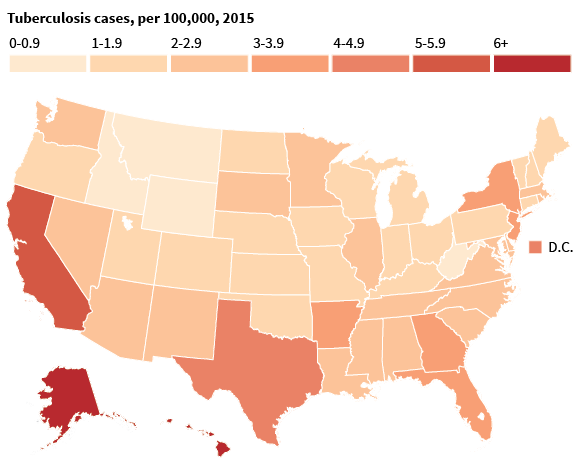

Data Science Dojo   
Copyright (c) 2019 - 2020

---

**Level:** Intermediate  
**Recommended Use:** Regression   
**Domain:** Healthcare  

---

## US Tuberculosis Dataset

---

The US Tuberculosis Dataset contains information about the number of reported cases of Tuberculosis (TB) in each state of the US in 2018.

The information in the dataset can be used to understand how TB has spread in each state over the course of 4 quarters and to predict how the disease may spread in the future. The dataset can be used to identify states under threat from the disease so that appropriate countermeasures can be taken.

This data set is recommended for exploring data visualization techniques (for example, making a heatmap as shown in the image) and implementing regression models for prediction tasks.

---

### Data Dictionary

| Column Number | Attribute                                   | Attribute Description                          | Data Type |
| ------------- | ------------------------------------------- | ---------------------------------------------- | --------- |
| 1             | Reporting Area                              | Area under consideration                       | Text      |
| 2             | MMWR Year                                   | Year under consideration                       | Year      |
| 3             | MMWR Quarter                                | Quarter under consideration                    | Numeric   |
| 4             | Tuberculosis, Current quarter               | Number of TB Patients in the Current Quarter   | Numeric   |
| 5             | Tuberculosis, Current quarter, flag         | Data point present/absent                      | Text      |
| 6             | Tuberculosis, Previous 4 quarters Min       | Number of minimum TB Patients in the last year | Numeric   |
| 7             | Tuberculosis, Previous 4 quarters Min, flag | Data point present/absent                      | Text      |
| 8             | Tuberculosis, Previous 4 quarters Max       | Number of maximum TB Patients in the last year | Numeric   |
| 9             | Tuberculosis, Previous 4 quarters Max, flag | Data point present/absent                      | Text      |
| 10            | Tuberculosis, Cum 2018                      | Total number of TB Patients in 2018            | Numeric   |
| 11            | Tuberculosis, Cum 2018, flag                | Data point present/absent                      | Text      |
| 12            | Tuberculosis, Cum 2017                      | Total number of TB Patients in 2017            | Numeric   |
| 13            | Tuberculosis, Cum 2017, flag                | Data point present/absent                      | Text      |

---

### Acknowledgement

This data set has been sourced from the [US Government's 
Open Data Initiative](https://catalog.data.gov/dataset/nndss-table-iii-tuberculosis-93e65).  
The Open Data Initiative page mentions the following as the original source of the
data set:  
*Centers for Disease Control and Prevention*
