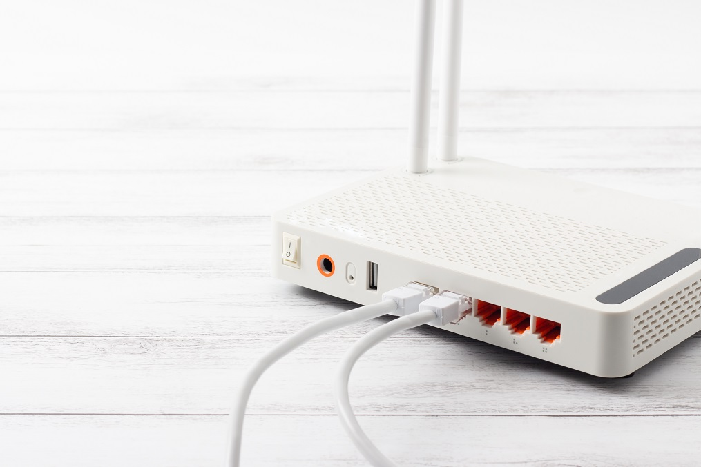

Data Science Dojo  
Copyright (c) 2019 - 2020

---

**Level:** Beginner  
**Recommended Use:** Classification Models 
**Domain:** Mobile/Location  

## Wireless Indoor Localization Data Set 

### Predict location from wifi signal strength 

---

---

This *beginner* level data set has 2000 rows and 8 columns.
The data set contains wifi signal strength observed from 7 wifi devices on a smartphone collected in indoor space. 
The data could be used to estimate the location in one of the four rooms.

This data set is recommended for learning and practicing your skills in **exploratory data analysis**, **data visualization**, and **classification modelling techniques**. 
Feel free to explore the data set with multiple **supervised** and **unsupervised** learning techniques. The Following data dictionary gives more details on this data set:

---

### Data Dictionary 

| Column   Position 	| Atrribute Name 	| Definition                           	| Data Type    	| Example       	| % Null Ratios 	|
|-------------------	|----------------	|--------------------------------------	|--------------	|---------------	|---------------	|
| 1                 	| Wifi 1         	| Signal strength of wifi 1            	| Quantitative 	| -42, -67, -50 	| 0             	|
| 2                 	| Wifi 2         	| Signal strength of wifi 2            	| Quantitative 	| -58, -64, -40 	| 0             	|
| 3                 	| Wifi 3         	| Signal strength of wifi 3            	| Quantitative 	| -65, -50, -70 	| 0             	|
| 4                 	| Wifi 4         	| Signal strength of wifi 4            	| Quantitative 	| -63, -59, -37 	| 0             	|
| 5                 	| Wifi 5         	| Signal strength of wifi 5            	| Quantitative 	| -80, -73, -56 	| 0             	|
| 6                 	| Wifi 6         	| Signal strength of wifi 6            	| Quantitative 	| -90, -75, -64 	| 0             	|
| 7                 	| Wifi 7         	| Signal strength of wifi 7            	| Quantitative 	| -91, -65, -83 	| 0             	|
| 8                 	| Room           	| One of the four rooms (1, 2, 3,   4) 	| Quantitative 	| 1, 2, 3       	| 0             	|

---

### Acknowledgement

This data set has been sourced from the Machine Learning Repository of University of California, Irvine [Wireless Indoor Localization Data Set (UC Irvine)](https://archive.ics.uci.edu/ml/datasets/Wireless+Indoor+Localization). 
The UCI page mentions the following 2 publications as the original source of the data set:

*1. Rajen Bhatt, 'Fuzzy-Rough Approaches for Pattern Classification: Hybrid measures, Mathematical analysis, Feature selection algorithms, Decision tree algorithms, Neural learning, and Applications', Amazon Books*  
*2. Jayant G Rohra, Boominathan Perumal, Swathi Jamjala Narayanan, Priya Thakur, and Rajen B Bhatt, 'User Localization in an Indoor Environment Using Fuzzy Hybrid of Particle Swarm Optimization & Gravitational Search Algorithm with Neural Networks', in Proceedings of Sixth International Conference on Soft Computing for Problem Solving,2017, pp. 286-295.*

